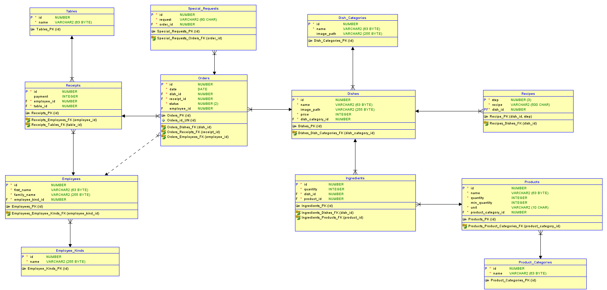

# Programowanie Aplikacyjne (PAP) - 21Z - Zespół 7

# Członkowie zespołu

- ### **Adam Sudoł**
- ### **Bartłomiej Krawczyk**
- ### **Kamil Sulkowski**
- ### **Karol Rogoziński**

# Wymagania i założenia projektu

### Zadanie polega na napisaniu systemu do obsługi restauracji.

Planujemy projekt stworzyć w architekturze klient-serwer. Będziemy mieli jeden główny serwer, który będzie komunikował się z bazą danych oraz aplikacje mobilne i desktopowe komunikujące się z serwerem.

### W ramach projektu stworzymy:

## Aplikacja desktopowa

Aplikacja desktopowa dla kucharzy napisana w języku Java z interfejsem graficznym napisanym przy użyciu biblioteki Swing

### Funkcjonalność:

- dla kucharzy

  - wyświetlanie oczekujących zamówień
  - możliwość przypisania siebie do wykonania dania
  - możliwość edycji statusu dania
  - wyświetlanie informacji o daniach (składniki, przepis, kategoria itp.)
  - edycja ilości składników na składzie po wykonanym zamówieniu (potencjalnie możemy to wykonać automatycznie na poziomie bazy danych)
  - możliwość wyświetlenia zamówień przypisanych do danego kucharza
  - logowanie jako kucharz
    - na jednym urządzeniu w tym samym czasie może być kilku kucharzy (nie wymagamy, aby każdy kucharz miał swój komputer)
    - początkowo jedynie wybór z listy kucharzy, a jeśli starczy czasu => implementacja pełnego logowania z hasłem (pewnie auth0)
    - wyświetlanie dań do przygotowania przez kucharzy w kilku oknach / podzielonym oknie
      - lub
    - możliwość szybkiego przełączania zalogowanych użytkowników

## Aplikacja mobilna

Aplikacja mobilna dla kelnerów napisana w języku Java na telefony Android.

### Funkcjonalność:

- dla kelnerów
  - dodawanie nowego rachunku
  - przeglądanie kategorii dań
  - przeglądanie dostępnych dań w ramach kategorii
  - składanie zamówień na dania w ramach danego rachunku
  - logowanie jako kelner
    - początkowo jedynie wybór z listy kelnerów, a jeśli starczy czasu => implementacja pełnego logowania z hasłem (pewnie auth0)
    - na jednym urządzeniu może być zalogowany tylko jeden użytkownik (zakładamy, że każdy kelner ma swój telefon)
  - wyświetlanie otwartego rachunku przypisanego do danego kelnera
  - zamknięcie rachunku - wyświetlenie sumy do zapłaty

## Api

Serwer napisany w języku Java przy wykorzystaniu framework Spring Boot.

### Funkcjonalność:

- ma służyć jako pośrednik między aplikacjami wykorzystywanymi przez pracowników, a bazą danych
- głównym zadaniem jest mapowanie obiektów z relacyjnej bazy danych na javowe obiekty i na odwrót

## Baza danych

Centralna baza danych Oracle

### Wstępny projekt bazy danych i relacji:

## Funkcjonalności opcjonalne, które planujemy wprowadzić, dopiero po wprowadzeniu funkcjonalności krytycznych:

(Funkcjonalności te można zastąpić bezpośrednim dostępem tych osób do bazy danych)

## Aplikacja desktopowa

Aplikacja desktopowa dla zaopatrzycieli i adminów napisana w języku Java z interfejsem graficznym napisanym przy użyciu biblioteki Swing

- do inwentarzu

  - wyświetlanie danych o zaopatrzeniu
  - wyświetlanie czego jest mało
  - aktualizacja ilości składników, gdy dotrze zaopatrzenie

- dla admina

  - crud składniki / produkty
  - crud dania
  - crud pracownicy
  - crud stoliki
  - crud kategorie
