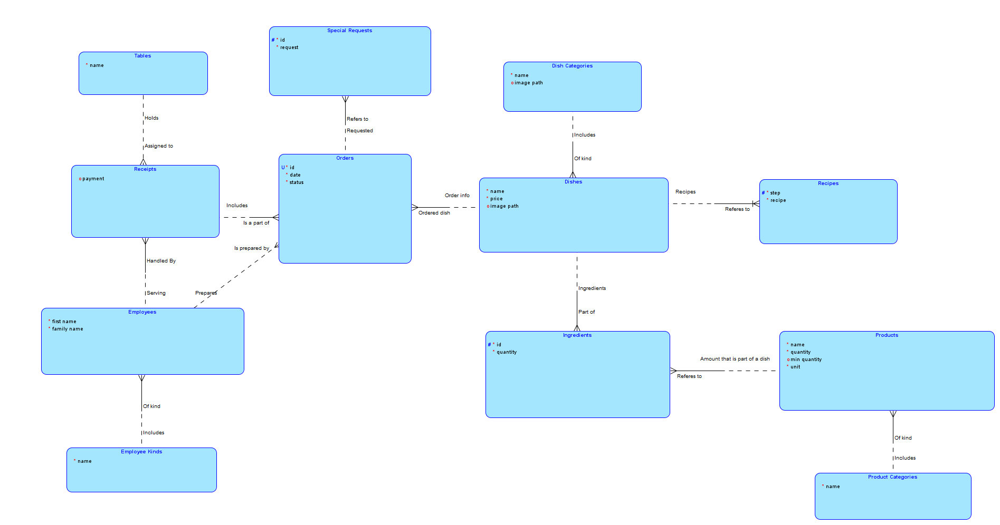
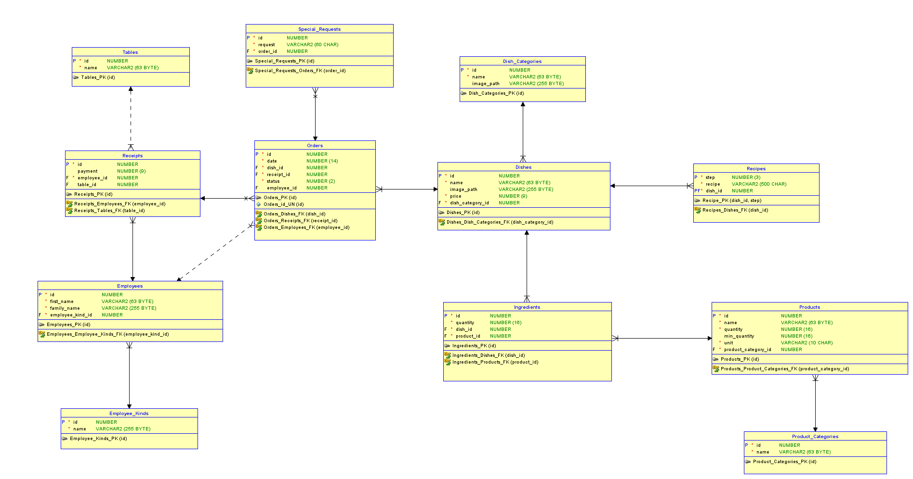
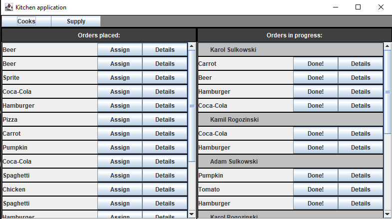
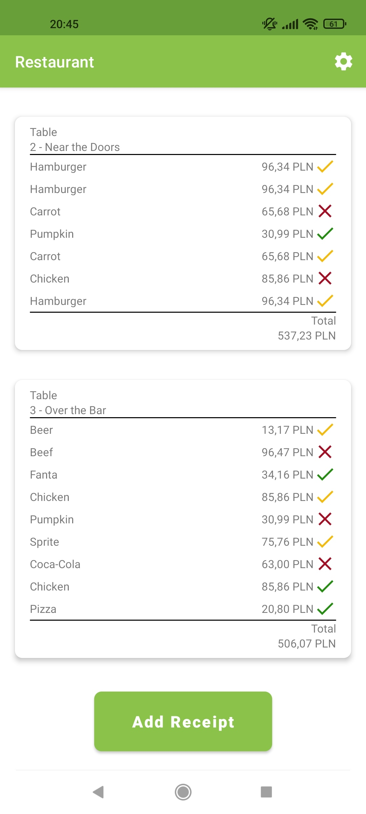
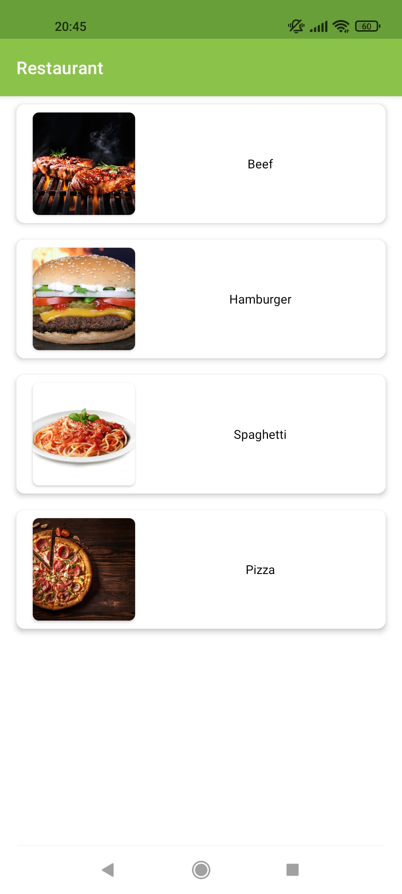

# Bazy Danych 1 - 99Z - Zespół 7

# Członkowie zespołu

- ### **Adam Sudoł**
- ### **Bartłomiej Krawczyk**
- ### **Kamil Sulkowski**
- ### **Karol Rogoziński**

# Opis Rozwiązania

Naszym zadaniem jest przygotowanie systemu do obsługi restauracji.
Wydzieliliśmy oddzielne aplikacje dla kucharzy oraz kelnerów.
Projekt wykonaliśmy w architekturze klient-serwer.
Posiadamy jeden główny serwer, który komunikuje się z bazą danych oraz aplikacje mobilne i desktopowe komunikujące się z serwerem.

### W ramach projektu stworzyliśmy:

## Baza danych

Centralna baza danych Oracle

### Model ER:

### Model Relacyjny:

## Api

Serwer napisany w języku Java przy wykorzystaniu framework Spring Boot oraz technologii JPA.

### Funkcjonalność:

- służy jako pośrednik między aplikacjami wykorzystywanymi przez pracowników, a bazą danych
- głównym zadaniem jest mapowanie obiektów z relacyjnej bazy danych na javowe obiekty i na odwrót

## Aplikacja desktopowa

Aplikacja desktopowa dla kucharzy napisana w języku Java z interfejsem graficznym napisanym przy użyciu biblioteki Swing lub JavaFX

### Funkcjonalność:

- dla kucharzy

  - wyświetlanie oczekujących zamówień
  - możliwość przypisania siebie do wykonania dania
  - możliwość edycji statusu dania
  - wyświetlanie informacji o daniach (składniki, przepis, kategoria itp.)
  - edycja ilości składników na składzie po wykonanym zamówieniu (wykonujemy to automatycznie na poziomie bazy danych)
  - możliwość wyświetlenia zamówień przypisanych do danego kucharza
  - logowanie jako kucharz
    - na jednym urządzeniu w tym samym czasie może być kilku kucharzy (nie wymagamy, aby każdy kucharz miał swój komputer)
    - wyświetlanie dań do przygotowania przez kucharzy na podzielonym oknie

  

## Aplikacja mobilna

Aplikacja mobilna dla kelnerów napisana w języku Java na telefony Android.

### Funkcjonalność:

- dla kelnerów
  - dodawanie nowego rachunku
  - przeglądanie kategorii dań
  - przeglądanie dostępnych dań w ramach kategorii
  - składanie zamówień na dania w ramach danego rachunku
  - logowanie jako kelner
    - na jednym urządzeniu może być zalogowany tylko jeden użytkownik (zakładamy, że każdy kelner ma swój telefon)
  - wyświetlanie otwartego rachunku przypisanego do danego kelnera
  - zamknięcie rachunku - wyświetlenie sumy do zapłaty

## Krytyczna ocena rozwiązania

### Znane ograniczenia:
- w takiej formie w jakiej przygotowaliśmy bazę danych, nie jesteśmy w stanie skalować systemu na więcej placówek, dla każdej nowej placówki należałoby założyć oddzielną bazę danych

### Możliwości dalszego rozwoju:

Aplikacja desktopowa dla adminów (w tej chwili funkcjonalności te można zastąpić bezpośrednim dostępem tych osób do bazy danych)

- dla admina

  - crud składniki / produkty
  - crud dania
  - crud pracownicy
  - crud stoliki
  - crud kategorie
