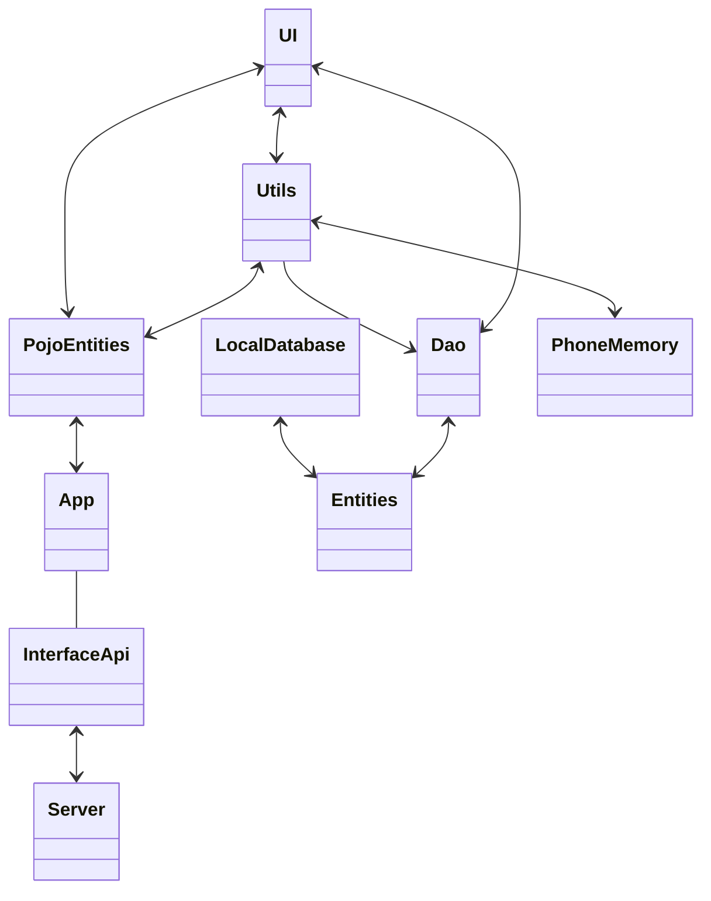
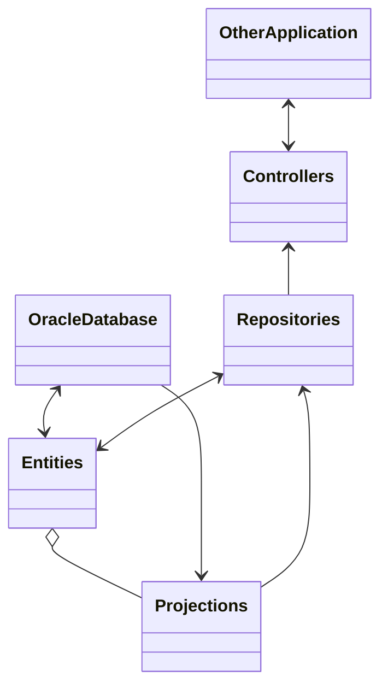

# Aplikacja Mobilna

W aplikacji mobilnej wyróżniamy kilka części:
### Kod java umieszczany w folderze java:

W głównym pakiecie znajduje się:
- klasa App
    - która pozwala na wykonywanie akcji w czasie odpalania m.in:
        - zainicjowanie komunikacji sieciowej
        - pobranie podstawowych danych
- interfejs InterfaceApi
    - który definiuje metody zaaonotowane odpowiednimi urlami
    - biblioteka Retrofit wykorzystuje je do wygenerowania odpowiednich metod do wyciągania danych z serwera

Wydzielone są również inne pakiety:
- entities:
    - zawierają klasy pojo wymagane przez aplikację, a udostępniane przez serwer
- database:
    - zawiera główny plik bazy danych abstrakcyjna klasa AppDatabase - singleton
    - interfejsy Dao, które definiują metody, wykorzystywane do dostępu do bazy danych
    - klasa ImageSaver umożliwiająca zapisywanie i odczyt zdjęć z telefonu
- utils:
    - klasy ze zdefiniowanymi metodami dostępu do serwera i zapisywanie otrzymanych danych na telefonie
- ui:
    - podzielone jest na pomniejsze foldery, gdzie każdy pakiet zawiera powiązane pliki - najczęściej jeden ekran w aplikacji i pliki pomocnicze

### Pliki xml zdefiniowane w `res` - resources:
Wydzielamy kilka rodzajów plików xml, każdy definiuje inne dane:
- layout - układ poszczególnych ekranów i pomniejszych części
- drawable - ikony wykorzystywane + kształty / tła
- values - zdefiniowane stringi, kolory, style itp.
- mipmap - ikony aplikacji
- anim - customowe animacje

# Aplikacja Desktopowa

# Serwer

W głównym pakiecie aplikacji `com.example.api` znajdują się dwa pliki bazowe:
- ApiApplication - jest to plik który uruchamia serwer
- SpringInitializer - który jest wykorzystywany do inicjalizacji Springa

Aplikacja jest podzielona na pomniejsze pakiety:
- `com.example.api.entities`
    - W pakiecie tym umieściliśmy klasy pojo wyznaczające obiekty, które udostępnia serwer i zdefiniowaliśmy adnotacje jpa, aby móc mapować dane z relacyjnej bazy danych na obiekty
- `com.example.api.repositories`
    - W pakiecie tym znajdują się interfejsy implementujące odpowiednie `CrudRepository` (każdy obiekt ma swoje repozytorium), umożliwiają one pominięcie części kodu, który zostaje wygenerowany za nas
- `com.example.api.controllers`
    - Klasy znajdujące się w tym pakiecie to kontorlery, które definiują funkcje które udostępnia serwer oraz mapuje je pod zdefiniowanymi url
    - Kontrolery korzystają ze zdefiniowanych wcześniej repozytoriów
- `com.example.api.projections`
    - Interfejsy projekcje, które pozwalają ograniczyć część danych pozyskiwanych z bazy danych, które nie są potrzebne w danej metodzie
- `com.example.api.errors`
    - Klasy z błędami umożliwiają definiowanie własnych błędów
